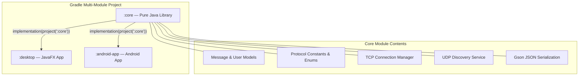
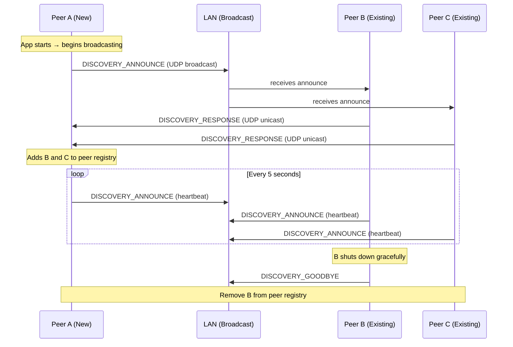
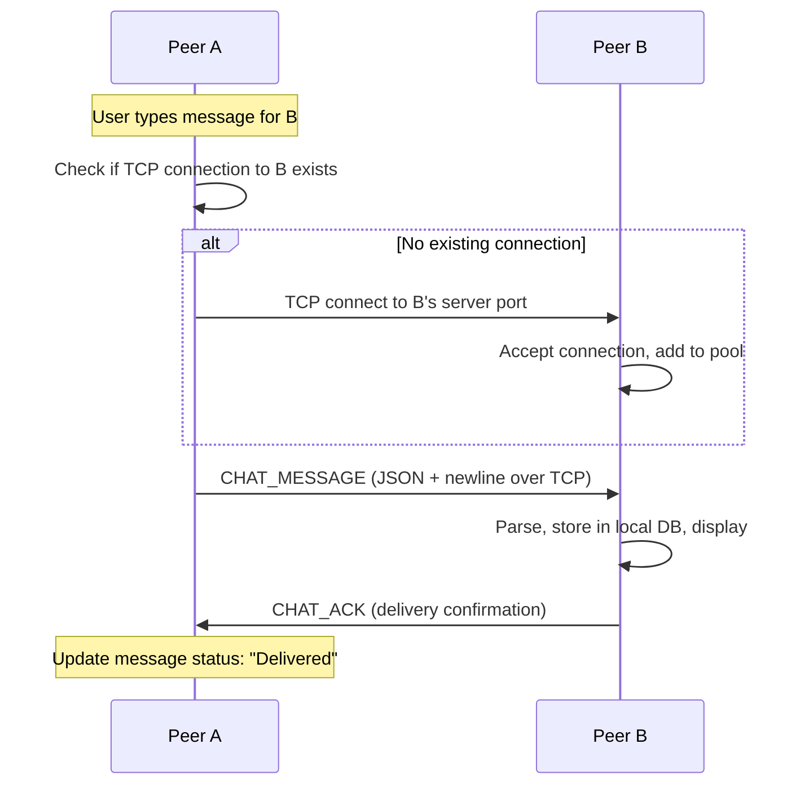
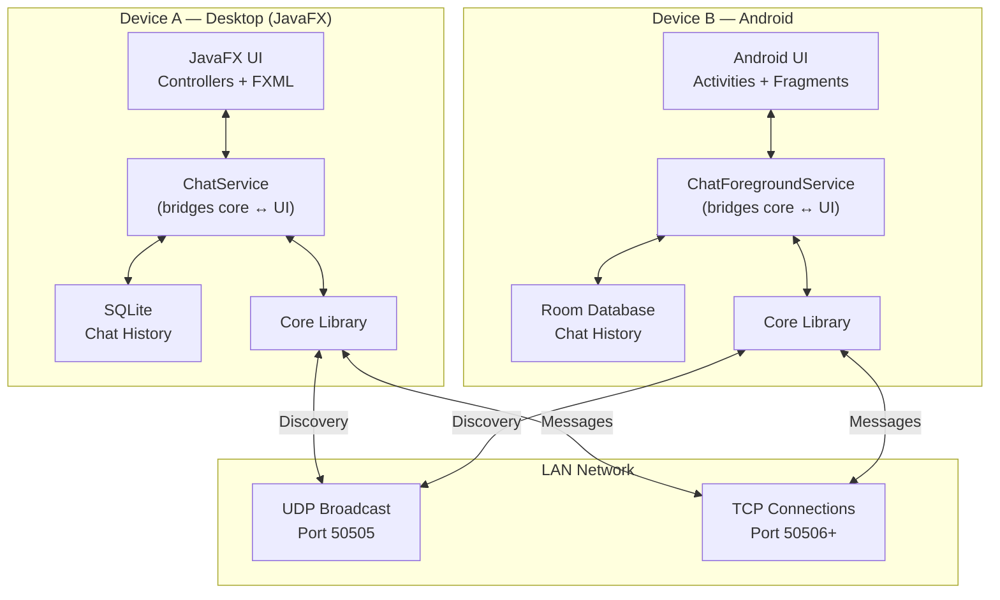

# Java LAN Chat — Cross-Platform Desktop & Android Application

> **M.Sc. IT Final Year Project**
> A beautiful, cross-platform LAN chat application built with Java, targeting both Desktop (JavaFX) and Android.

## Overview

This project implements a **peer-to-peer LAN chat application** using a hybrid networking architecture: **UDP broadcast for peer discovery** and **TCP sockets for reliable messaging**. A shared pure-Java core library handles all networking and protocol logic, while platform-specific modules provide native UI experiences on Desktop (JavaFX 21) and Android (Material Design).



---

## User Review Required

> [!IMPORTANT]
> **Architecture Choice: Peer-to-Peer vs Server-Based**
> This plan uses a **P2P (peer-to-peer)** architecture where every device both sends and receives directly — no central server needed. This is simpler to deploy on a LAN (no server setup), but each device manages its own connections. An alternative is a **server-client** model where one device acts as a relay server.
> **Recommendation**: P2P — more suitable for LAN, no single point of failure, and demonstrates more complex networking concepts (good for M.Sc.).

> [!IMPORTANT]
> **UI Framework: JavaFX 21 + AtlantaFX Theme**
> The plan uses JavaFX with the AtlantaFX theme library for a modern, CSS-styled desktop UI. Swing is an alternative but would require significantly more effort for a polished look. JavaFX also supports FXML for declarative UI layout (similar to Android XML layouts — a nice parallel for your thesis).

> [!WARNING]
> **Java Version: Java 17 as Common Baseline**
> Java 17 is used as the common baseline since Android supports it via desugaring. If you want to use Virtual Threads (Java 21+), they will only be available on the Desktop module. The core module must stay at Java 17 for Android compatibility.

---

## Open Questions

> [!IMPORTANT]
> 1. **Project package name**: The plan uses `com.lanchat` — do you have a preferred package name (e.g., `com.adi.lanchat`, `in.adi.lanchat`)?
> 2. **Android build environment**: Do you have Android SDK installed? Do you plan to use Android Studio for the Android module, or build everything from the command line with Gradle?
> 3. **Feature priority**: The plan includes 3 tiers of features. For your thesis timeline, should we focus on Tier 1 first and add Tier 2/3 incrementally, or do you want to target specific features from Tier 2/3 from the start?
> 4. **Encryption (TLS)**: Tier 2 includes TLS encryption. Would you like this included from the beginning (more complex setup) or added as an enhancement after core features work?
> 5. **Chat history storage on Desktop**: The plan uses SQLite (via JDBC) on desktop. An alternative is simple JSON flat files. SQLite is more robust and mirrors the Room approach on Android. Preference?

---

## Technology Stack

| Layer | Technology | Rationale |
|-------|-----------|-----------|
| **Language** | Java 17 | Common baseline for Desktop + Android |
| **Build System** | Gradle 8.x (Kotlin DSL) | Multi-module support, version catalogs |
| **Shared Core** | `java-library` Gradle module | Pure Java — no platform dependencies |
| **Desktop UI** | JavaFX 21 + AtlantaFX | Modern CSS-styled UI, FXML layouts |
| **Android UI** | Material Components + RecyclerView | Standard modern Android UI |
| **Discovery** | UDP Broadcast | LAN peer discovery via heartbeat |
| **Messaging** | TCP Sockets (`Socket`/`ServerSocket`) | Reliable message delivery |
| **Serialization** | Gson (JSON) | Lightweight, works on both platforms |
| **Desktop Storage** | SQLite (via JDBC) | Local chat history |
| **Android Storage** | Room (SQLite ORM) | Local chat history |
| **Icons** | Ikonli (Desktop), Material Icons (Android) | Vector icon packs |
| **Distribution** | jpackage (Desktop), APK (Android) | Native installers |

---

## Project Structure

```
lan-chat/
├── settings.gradle.kts                 # Module declarations
├── build.gradle.kts                    # Root build config
├── gradle/
│   └── libs.versions.toml             # Centralized dependency versions
│
├── core/                              # ── Shared Pure Java Library ──
│   ├── build.gradle.kts
│   └── src/main/java/com/lanchat/core/
│       ├── model/
│       │   ├── User.java              # User identity (id, displayName, ip, port)
│       │   ├── Peer.java              # Discovered peer with status & last-seen
│       │   ├── ChatMessage.java       # Chat message POJO
│       │   └── ChatRoom.java          # Group/room definition
│       ├── protocol/
│       │   ├── MessageType.java       # Enum: CHAT, DISCOVERY, FILE_TRANSFER, etc.
│       │   ├── ProtocolMessage.java   # Top-level wire message wrapper
│       │   ├── ProtocolConstants.java # Ports, timeouts, version
│       │   └── PayloadFactory.java    # Create typed payloads
│       ├── network/
│       │   ├── TCPConnectionManager.java   # Manage TCP connections to peers
│       │   ├── TCPMessageHandler.java      # Interface: onMessageReceived, onDisconnected
│       │   ├── UDPDiscoveryService.java    # Broadcast/listen for peer announcements
│       │   ├── DiscoveryListener.java      # Interface: onPeerDiscovered, onPeerLost
│       │   └── PeerRegistry.java           # Thread-safe registry of known peers
│       └── serialization/
│           └── MessageSerializer.java      # Gson-based serialize/deserialize
│
├── desktop/                           # ── JavaFX Desktop Application ──
│   ├── build.gradle.kts
│   └── src/
│       ├── main/java/com/lanchat/desktop/
│       │   ├── App.java               # JavaFX Application entry point
│       │   ├── controller/
│       │   │   ├── MainController.java     # Main window controller
│       │   │   ├── ChatController.java     # Chat view controller
│       │   │   ├── LoginController.java    # Username selection screen
│       │   │   └── SettingsController.java # Settings panel
│       │   ├── service/
│       │   │   ├── ChatService.java        # Bridges core networking ↔ UI
│       │   │   ├── NotificationService.java # Desktop notifications
│       │   │   └── HistoryService.java     # SQLite chat history
│       │   ├── component/
│       │   │   ├── ChatBubble.java         # Custom chat bubble component
│       │   │   ├── PeerListCell.java       # Online user list cell
│       │   │   └── ChatRoomTab.java        # Tab for each chat room
│       │   └── util/
│       │       └── UIUtils.java            # Formatting, avatar generation
│       └── main/resources/
│           ├── fxml/
│           │   ├── main.fxml               # Main layout
│           │   ├── chat.fxml               # Chat panel
│           │   └── login.fxml              # Login screen
│           └── css/
│               └── styles.css              # Application stylesheet
│
├── android-app/                       # ── Android Application ──
│   ├── build.gradle.kts
│   └── src/main/
│       ├── AndroidManifest.xml
│       ├── java/com/lanchat/android/
│       │   ├── ui/
│       │   │   ├── LoginActivity.java      # Username selection
│       │   │   ├── MainActivity.java       # Main chat screen
│       │   │   ├── ChatFragment.java       # Individual chat view
│       │   │   ├── PeerListFragment.java   # Online users list
│       │   │   └── adapter/
│       │   │       ├── MessageAdapter.java # RecyclerView adapter for messages
│       │   │       └── PeerAdapter.java    # RecyclerView adapter for peers
│       │   ├── service/
│       │   │   ├── ChatForegroundService.java # Foreground service for networking
│       │   │   └── NsdDiscoveryWrapper.java   # Android NSD API wrapper
│       │   ├── data/
│       │   │   ├── AppDatabase.java        # Room database
│       │   │   ├── MessageDao.java         # Room DAO for messages
│       │   │   └── MessageEntity.java      # Room entity
│       │   └── util/
│       │       └── AndroidUtils.java       # Android-specific helpers
│       └── res/
│           ├── layout/                     # XML layouts
│           ├── values/                     # Colors, strings, themes
│           ├── drawable/                   # Icons, shapes
│           └── mipmap/                     # App icon
│
└── docs/                              # ── Project Documentation ──
    ├── architecture.md                 # System architecture document
    ├── protocol-spec.md                # Wire protocol specification
    └── diagrams/                       # UML, sequence diagrams
```

---

## Protocol Design

All messages are serialized as **single-line JSON**, terminated by `\n`. This enables simple parsing via `BufferedReader.readLine()`.

### Wire Message Format

```json
{
  "version": 1,
  "type": "CHAT_MESSAGE",
  "messageId": "550e8400-e29b-41d4-a716-446655440000",
  "sender": {
    "userId": "user-uuid",
    "displayName": "Adi",
    "ip": "192.168.1.5",
    "port": 50506
  },
  "timestamp": 1717747200000,
  "payload": { }
}
```

### Message Types

| Type | Transport | Direction | Payload | Description |
|------|-----------|-----------|---------|-------------|
| `DISCOVERY_ANNOUNCE` | UDP Broadcast | 1 → All | `{displayName, port}` | Periodic "I'm here" heartbeat (every 5s) |
| `DISCOVERY_RESPONSE` | UDP Unicast | 1 → 1 | `{displayName, port}` | Reply to announce |
| `DISCOVERY_GOODBYE` | UDP Broadcast | 1 → All | `{}` | Graceful disconnect |
| `CHAT_MESSAGE` | TCP | 1 → 1 or 1 → Group | `{text, roomId}` | Text chat message |
| `CHAT_ACK` | TCP | 1 → 1 | `{ackMessageId}` | Delivery acknowledgment |
| `FILE_TRANSFER_REQUEST` | TCP | 1 → 1 | `{fileName, fileSize, checksum}` | Request to send a file |
| `FILE_TRANSFER_ACCEPT` | TCP | 1 → 1 | `{transferId, port}` | Accept file (opens new TCP port) |
| `FILE_TRANSFER_REJECT` | TCP | 1 → 1 | `{transferId, reason}` | Decline file transfer |
| `TYPING_INDICATOR` | TCP | 1 → 1 | `{roomId, isTyping}` | User typing status |
| `PRESENCE_UPDATE` | UDP Broadcast | 1 → All | `{status: ONLINE/AWAY/BUSY}` | Status change |

### Discovery Flow



### Messaging Flow



---

## Feature Tiers

### Tier 1 — Core (Must Have)

These are the essential features that form the minimum viable product:

- [ ] **P1.1** — User identity: username selection on app start, UUID assignment
- [ ] **P1.2** — UDP peer discovery: broadcast announce, heartbeat, goodbye
- [ ] **P1.3** — Peer registry: track online peers, auto-remove stale peers (15s timeout)
- [ ] **P1.4** — One-to-one TCP messaging: send/receive text messages
- [ ] **P1.5** — Group chat: at least one "General" room all peers auto-join
- [ ] **P1.6** — Desktop UI: login screen, peer list sidebar, chat view with bubbles
- [ ] **P1.7** — Android UI: login activity, peer list, chat view with RecyclerView
- [ ] **P1.8** — Local message history: persist messages (SQLite desktop, Room android)
- [ ] **P1.9** — Cross-platform interop: desktop ↔ android messaging works correctly

### Tier 2 — Enhanced (Should Have)

Features that add polish and demonstrate deeper technical knowledge:

- [ ] **P2.1** — File transfer: send files between peers with progress indicator
- [ ] **P2.2** — Typing indicators: show "User is typing…" in real-time
- [ ] **P2.3** — Message delivery acknowledgment: sent ✓ / delivered ✓✓
- [ ] **P2.4** — User presence status: Online / Away / Busy / Offline
- [ ] **P2.5** — TLS encryption: secure all TCP communication with SSLSocket

### Tier 3 — Polish (Nice to Have)

- [ ] **P3.1** — Read receipts: mark messages as read when viewed
- [ ] **P3.2** — Emoji support in messages
- [ ] **P3.3** — Desktop system tray integration: minimize to tray, notification popups
- [ ] **P3.4** — Android foreground service: background messaging with notifications
- [ ] **P3.5** — Chat history search

---

## Proposed Changes — Phased Development

### Phase 1: Project Scaffolding & Build System

Set up the Gradle multi-module project with all build configuration.

#### [NEW] [settings.gradle.kts](file:///home/adi/Projects/Java/Lan%20Chat/settings.gradle.kts)
- Root project name `lan-chat`, include `:core`, `:desktop`, `:android-app`

#### [NEW] [build.gradle.kts](file:///home/adi/Projects/Java/Lan%20Chat/build.gradle.kts)
- Root build script with common configuration

#### [NEW] [libs.versions.toml](file:///home/adi/Projects/Java/Lan%20Chat/gradle/libs.versions.toml)
- Centralized versions: Gson 2.11.0, JavaFX 21, AtlantaFX 2.0.1, Room 2.6.1, Material 1.12.0

#### [NEW] [core/build.gradle.kts](file:///home/adi/Projects/Java/Lan%20Chat/core/build.gradle.kts)
- `java-library` plugin, Java 17, Gson dependency

#### [NEW] [desktop/build.gradle.kts](file:///home/adi/Projects/Java/Lan%20Chat/desktop/build.gradle.kts)
- `application` + `javafx` plugin, depends on `:core`, AtlantaFX + Ikonli

#### [NEW] [android-app/build.gradle.kts](file:///home/adi/Projects/Java/Lan%20Chat/android-app/build.gradle.kts)
- Android application plugin, minSdk 24, targetSdk 35, depends on `:core`, Room + Material

---

### Phase 2: Core Networking Library

Build the shared networking layer — the heart of the application.

#### [NEW] `core/src/main/java/com/lanchat/core/model/`
- **User.java**: `userId` (UUID), `displayName`, `ipAddress`, `port`
- **Peer.java**: Extends User with `status` (enum), `lastSeen` (timestamp)
- **ChatMessage.java**: `messageId`, `senderId`, `roomId`, `text`, `timestamp`, `status` (SENT/DELIVERED/READ)
- **ChatRoom.java**: `roomId`, `name`, `memberIds`, `isGeneral`

#### [NEW] `core/src/main/java/com/lanchat/core/protocol/`
- **MessageType.java**: Enum with all 10 message types
- **ProtocolMessage.java**: Top-level wrapper with `version`, `type`, `messageId`, `sender`, `timestamp`, `payload` (as `JsonObject`)
- **ProtocolConstants.java**: `DISCOVERY_PORT = 50505`, `DEFAULT_TCP_PORT = 50506`, `HEARTBEAT_INTERVAL_MS = 5000`, `PEER_TIMEOUT_MS = 15000`, `PROTOCOL_VERSION = 1`

#### [NEW] `core/src/main/java/com/lanchat/core/serialization/`
- **MessageSerializer.java**: `serialize(ProtocolMessage) → String`, `deserialize(String) → ProtocolMessage`, payload extraction helpers

#### [NEW] `core/src/main/java/com/lanchat/core/network/`
- **UDPDiscoveryService.java**: Broadcasts announces, listens for peers, manages heartbeat timer, fires `DiscoveryListener` callbacks
- **DiscoveryListener.java**: Interface with `onPeerDiscovered(Peer)`, `onPeerUpdated(Peer)`, `onPeerLost(Peer)`
- **PeerRegistry.java**: Thread-safe `ConcurrentHashMap<String, Peer>`, auto-eviction of stale peers
- **TCPConnectionManager.java**: Manages `ServerSocket` for incoming + `Map<String, Socket>` for outgoing connections; sends/receives JSON lines
- **TCPMessageHandler.java**: Interface with `onMessageReceived(ProtocolMessage, String peerId)`, `onConnectionLost(String peerId)`

---

### Phase 3: Desktop Application (JavaFX)

Build the desktop UI with a modern, beautiful design.

#### [NEW] `desktop/src/main/java/com/lanchat/desktop/App.java`
- JavaFX `Application` subclass, loads AtlantaFX theme, sets up primary stage

#### [NEW] `desktop/src/main/resources/fxml/login.fxml` + `LoginController.java`
- Clean login screen: app logo, username text field, "Join Chat" button
- Validates username, initializes `User` object

#### [NEW] `desktop/src/main/resources/fxml/main.fxml` + `MainController.java`
- **Left sidebar**: Online peers list with status indicators (green/yellow/red dots)
- **Center**: Chat area with message bubbles (sent = right-aligned blue, received = left-aligned gray)
- **Bottom**: Message input bar with send button
- **Top**: Room selector tabs (General + active private chats)

#### [NEW] `desktop/src/main/java/com/lanchat/desktop/component/`
- **ChatBubble.java**: Custom `VBox` component with CSS-styled rounded bubbles, timestamp, delivery status
- **PeerListCell.java**: Custom `ListCell` with avatar circle, name, status dot
- **ChatRoomTab.java**: `Tab` subclass with unread message badge

#### [NEW] `desktop/src/main/resources/css/styles.css`
- Modern dark theme with glassmorphism sidebar
- Chat bubble styles (sent/received differentiation)
- Smooth hover transitions, focus effects
- Custom scrollbar styling

#### [NEW] `desktop/src/main/java/com/lanchat/desktop/service/`
- **ChatService.java**: Initializes core networking, bridges events to JavaFX `Platform.runLater()`
- **HistoryService.java**: SQLite via JDBC for storing/retrieving messages

---

### Phase 4: Android Application

Build the Android UI with Material Design.

#### [NEW] `android-app/src/main/AndroidManifest.xml`
- Permissions: `INTERNET`, `ACCESS_WIFI_STATE`, `CHANGE_WIFI_MULTICAST_STATE`, `ACCESS_NETWORK_STATE`
- `android:usesCleartextTraffic="true"` for LAN TCP
- Activities: `LoginActivity`, `MainActivity`

#### [NEW] `android-app/src/main/java/com/lanchat/android/ui/LoginActivity.java`
- Material Design login: app name, username input (`TextInputLayout`), "Join" button

#### [NEW] `android-app/src/main/java/com/lanchat/android/ui/MainActivity.java`
- Navigation: bottom navigation or drawer with Peers list + Chat tabs
- Hosts `PeerListFragment` and `ChatFragment`

#### [NEW] `android-app/src/main/java/com/lanchat/android/ui/ChatFragment.java`
- `RecyclerView` with `MessageAdapter` for chat bubbles
- Input bar with `TextInputEditText` + send FAB

#### [NEW] `android-app/src/main/java/com/lanchat/android/ui/adapter/`
- **MessageAdapter.java**: ViewHolder pattern, two view types (sent/received), bubble styling
- **PeerAdapter.java**: Online users with status indicators

#### [NEW] `android-app/src/main/java/com/lanchat/android/data/`
- **AppDatabase.java**: Room database with `MessageEntity`
- **MessageDao.java**: Insert, query by room, query by peer
- **MessageEntity.java**: Room entity mirroring `ChatMessage`

#### [NEW] `android-app/src/main/res/`
- `layout/`: Activity and fragment layouts, chat bubble item layouts
- `values/`: Material theme colors (dark + light), strings
- `drawable/`: Chat bubble shapes, status dot drawables

---

### Phase 5: Integration & Cross-Platform Testing

- [ ] Test desktop ↔ desktop messaging
- [ ] Test android ↔ android messaging
- [ ] Test desktop ↔ android messaging (cross-platform interop)
- [ ] Test peer discovery with multiple devices on same LAN
- [ ] Test graceful disconnect (goodbye packets)
- [ ] Test stale peer eviction (kill a device without graceful shutdown)
- [ ] Test message history persistence across restarts

---

### Phase 6: Tier 2 Enhancements (Iterative)

Implement based on timeline and priority:

- **File transfer**: New TCP connection per transfer, length-prefixed binary protocol, progress callbacks
- **Typing indicators**: Debounced typing events, auto-expire after 3 seconds
- **Delivery ACKs**: Track message status transitions (SENT → DELIVERED → READ)
- **Presence status**: UI controls to change status, broadcast via UDP
- **TLS encryption**: Self-signed certificates, `SSLSocket`/`SSLServerSocket` wrapper

---

## Architecture Diagram



---

## Verification Plan

### Automated Tests

```bash
# Unit tests for core module (protocol, serialization, models)
./gradlew :core:test

# Desktop compilation check
./gradlew :desktop:build

# Android compilation + instrumented tests
./gradlew :android-app:connectedAndroidTest
```

### Manual Verification

| Test Case | Method |
|-----------|--------|
| Peer discovery | Run 2+ desktop instances on same LAN, verify mutual discovery |
| Cross-platform chat | Send message from desktop → Android and vice versa |
| Group chat | 3+ peers join General room, verify all receive messages |
| Peer disconnect | Kill one app, verify others mark it offline within 15s |
| Message persistence | Restart app, verify chat history loads from local DB |
| File transfer (Tier 2) | Send a file, verify integrity with checksum |
| UI responsiveness | Send rapid messages, verify no UI lag or freezes |

### Academic Deliverables

- System architecture diagram (UML component diagram)
- Class diagrams for core module
- Sequence diagrams for discovery and messaging flows
- Performance metrics: message latency (ms), max concurrent peers tested
- Security analysis: threat model for LAN environment
- Comparison table: P2P vs server-client, UDP vs mDNS, JavaFX vs Swing
